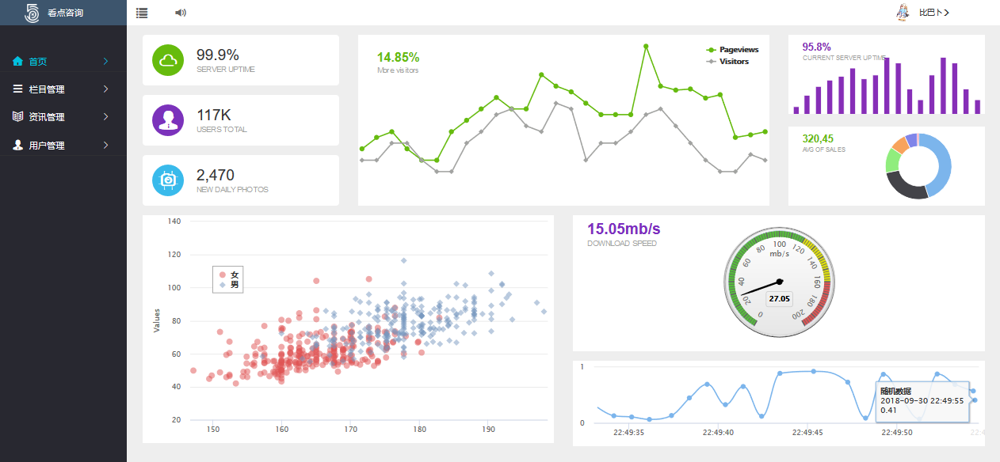

# Info-news
文章后台管理系统
### 基础开发
* `Html`+`CSS`+`JavaScript`+`AJAX`
### 类库
* DOM操作：`JQuery`       
* 页面展示：`BootStrap`  
* CSS预编译：`Sass`
* API接口UI：`Swagger UI`
* 其他：`IconFont`+`Highcharts`
### 实现功能
* 首页动态图表展示
* 用户管理：用户的新增和保存功能
* 栏目管理：新增，修改，删除和批量删除
* 资讯管理：新增，修改，删除和批量删除
### 首页效果图
 

